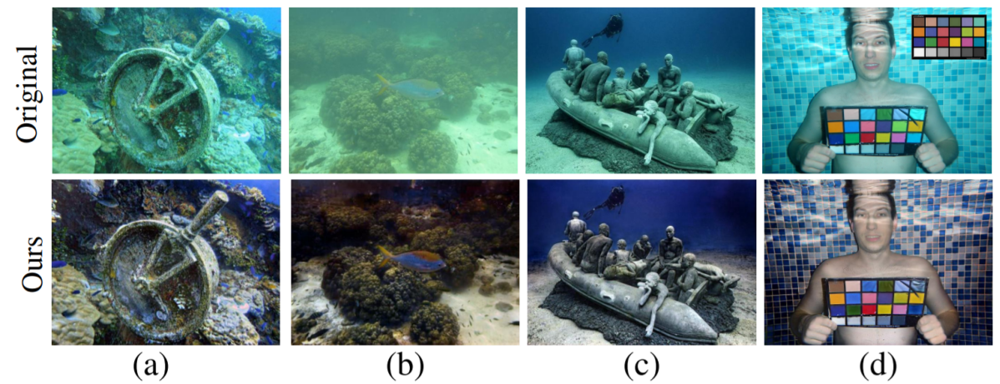
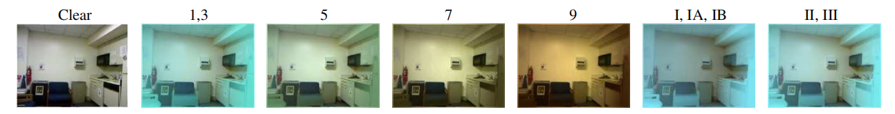

# UIE-WD Code (ICASSP 2022)
This is the code and datasets for "A Wavelet-based Dual-stream Network for Underwater Image Enhancement", ICASSP, 2022.  
[paper]() | [website](https://zziyin.github.io/UIE-WD.html)

## Requirement
1. Clone repository

    <code>git clone https://github.com/ZZiyin/UIE-WD_Code.git</code>

2. Check the requirement.txt

    <code>pip install -r requirements.txt</code>

## Dataset 
The synthesized training dataset is generated from [NYU Depth V2](https://cs.nyu.edu/~silberman/datasets/nyu_depth_v2.html) following [Anwar et al. (2018)](https://arxiv.org/abs/1807.03528), which consists of 1449 images. The dataset is augmented by generating 6 images of each class using random parameters, thus for each ground truth image, we have corresponding 36 images of different water types. 

Use the following code to generate training dataset.
    
<code>python dataset_nyu.py nyu_rgbd_path datapath </code>

**Arguments:**
- `nyu_rgbd_path`: The path of NYU Depth V2 dataset (.mat)
- `datapath`:  The path of file where you would like to store the genereated synthesized training images.

## Testing
Pretrained models can be found in the <code>./checkpoints</code>. Use the following code to generate results. And the enhanced images can be found in <code>./results</code>.

<code>python test_multi.py multi --test_dataset UIEB --data_path ../UIEB/raw-890 --model_load_path checkpoints/multi/model.pth </code>

**Arguments:**
-  `test_dataset`: The name of dataset you would like to use for testing.
-  `data_path`: The path of dataset you would like to use for testing.
-  `model_load_path`: The path of pretrained model.

## Environment
We conduct training and testing on Intel Core i5-7200 CPU and NVIDIA Geforce RTX 2070 GPU. Noted that the provided model is retrianed on Tesla T4 as the previous server is not accessible at the moment, we will update the pretrained model soon.

## Citation
